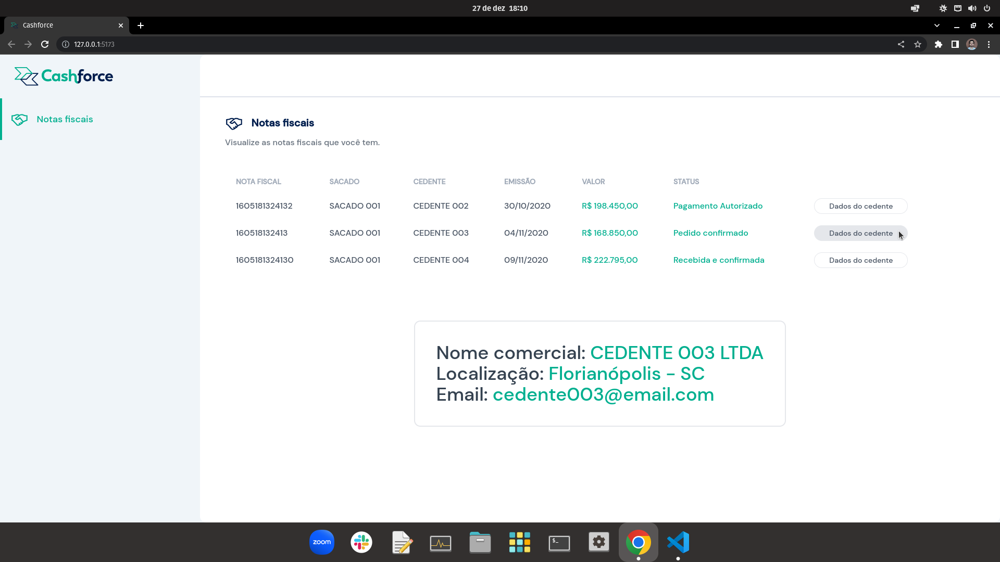

# Cashforce



## Inicialização

1.
```
git clone git@github.com:talesrodriguesDEV/cashforce.git
```

2.
```
cd backend
docker-compose up -d
docker exec -it api-container sh
npx sequelize-cli db:create && npx sequelize-cli db:migrate && npx sequelize-cli db:seed:all
```

3.
```
cd frontend
npm run dev
```
